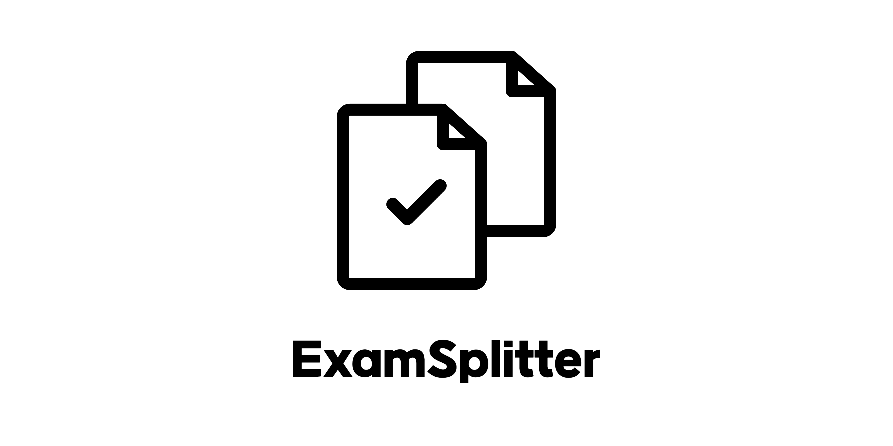

<div align="center">
  <h1>ExamSplitter</h1>
  
</div>

## 프로젝트 소개
ExamSplitter는 한국 교육과정 평가원이 주최한 모의고사나 수능 PDF 파일을 업로드하면 각 문제 영역을 자동으로 감지하고, 다양한 형식으로 분할하여 제공하는 데스크톱 애플리케이션입니다.

## 주요 기능

- **문제 영역 자동 감지**: YOLOv8 모델을 사용한 정확한 문제 영역 감지
- **다중 출력 형식**: 개별 이미지, 개별 PDF, 그룹 PDF, 전체 문제집 PDF
- **데스크톱 인터페이스**: tkinter 기반의 직관적인 사용자 인터페이스
- **사용자 설정**: DPI, 감지 신뢰도 등 세부 설정 가능
- **실시간 편집**: 드래그 앤 드롭으로 박스 크기/위치 조정

## 설치 방법

### 1. 저장소 클론
```bash
git clone https://github.com/d3vksy/ExamSplitter.git
cd ExamSplitter
```

### 2. 의존성 설치
```bash
pip install -r requirements.txt
```

### 3. 실행
```bash
python main.py
```

## 사용 방법

1. **PDF 업로드**: 모의고사 또는 수능 PDF 파일을 업로드
2. **설정 조정**: DPI, 감지 신뢰도, 출력 형식 선택
3. **문제 감지**: 문제 영역을 자동으로 감지
4. **분할 실행**: 선택한 형식으로 문제 분할
5. **결과 다운로드**: 생성된 파일들을 다운로드

## 기술 스택

- **Frontend**: tkinter (Python 기본 GUI)
- **AI/ML**: YOLOv8
- **PDF 처리**: PyMuPDF, ReportLab
- **이미지 처리**: OpenCV, PIL
- **언어**: Python 3.8+

## 프로젝트 구조

```
ExamSplitter/
├── main.py                 # 애플리케이션 실행 파일
├── requirements.txt        # Python 패키지 의존성
├── README.md              # 프로젝트 문서
├── LICENSE                # MIT 라이선스
├── src/                   # 소스 코드
│   ├── main.py            # 메인 애플리케이션 클래스
│   ├── config/
│   │   └── settings.py    # 애플리케이션 설정
│   ├── core/
│   │   ├── exceptions.py  # 예외 처리
│   │   └── models.py      # 데이터 모델
│   ├── ui/
│   │   ├── main_window.py # 메인 윈도우
│   │   ├── canvas_widget.py # 이미지 캔버스
│   │   └── settings_panel.py # 설정 패널
│   └── utils/
│       ├── logger.py      # 로깅 유틸리티
│       ├── question_detector.py # 문제 감지 (YOLO)
│       ├── pdf_generator.py # PDF 생성
│       └── validators.py  # 입력 검증
├── models/                # YOLO 모델 파일들 (.pt)
├── outputs/               # 생성된 파일들 (Git 제외)
└── logs/                  # 로그 파일들 (Git 제외)
```

## 라이선스

이 프로젝트는 MIT 라이선스 하에 배포됩니다.

