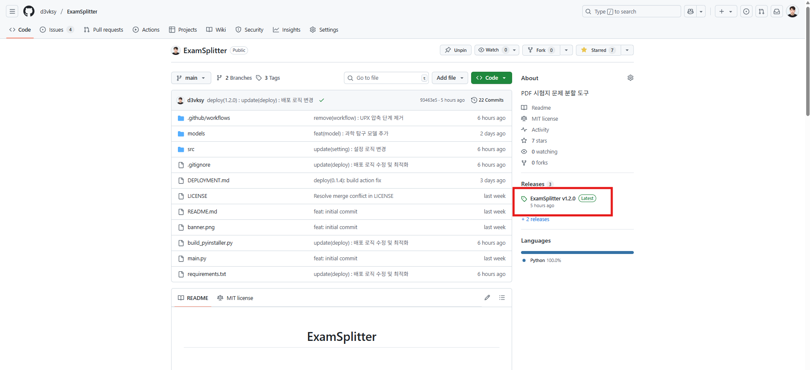
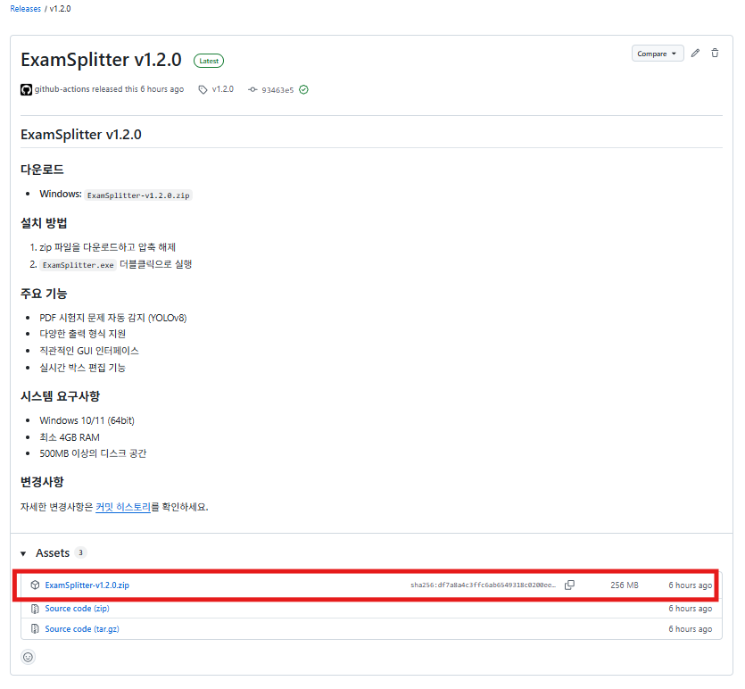
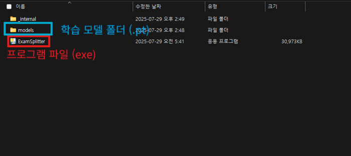
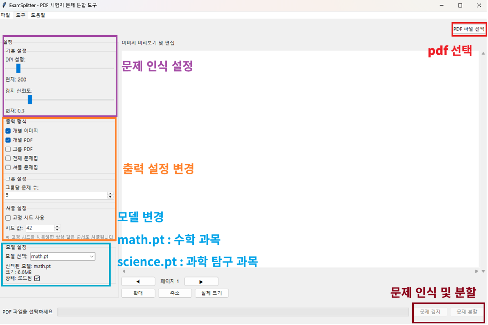
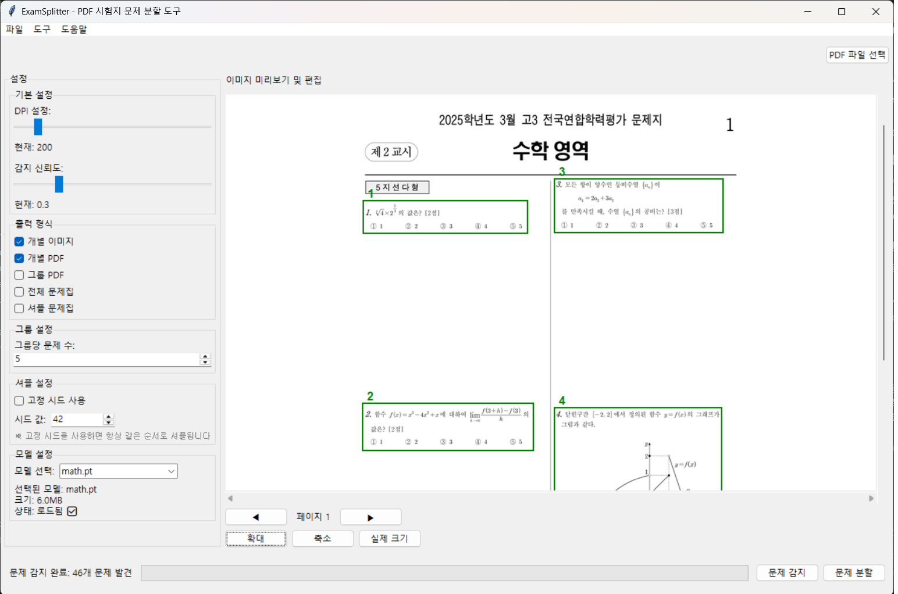
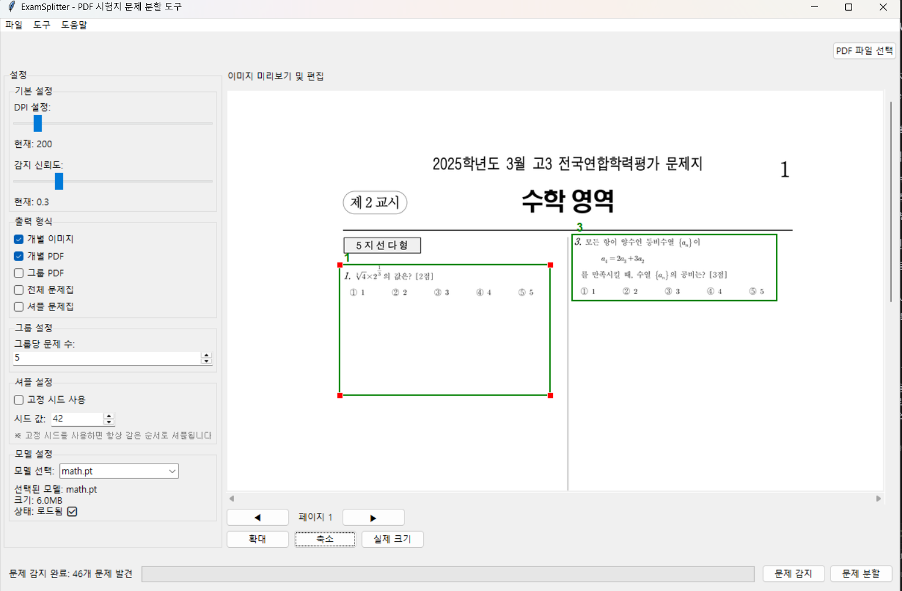

# ExamSplitter 사용자 매뉴얼

## 프로그램 소개

ExamSplitter는 한국 교육과정 평가원이 주최한 모의고사나 수능 PDF 파일을 업로드하면 각 문제 영역을 자동으로 감지하고, 다양한 형식으로 분할하여 제공하는 프로그램입니다.

## 설치 및 실행

### 1. 다운로드

- GitHub Releases에서 최신 버전 다운로드
- `ExamSplitter-v{버전}.zip` 파일을 원하는 폴더에 압축 해제

### 2. 실행

- 압축 해제한 폴더에서 `ExamSplitter.exe` 더블클릭
- 프로그램이 시작되면 메인 화면이 나타납니다

## 기본 사용법

### 1. PDF 파일 업로드
1. **파일 선택** 버튼 클릭
2. 모의고사 또는 수능 PDF 파일 선택
3. 파일이 로드되면 첫 번째 페이지가 화면에 표시됩니다

### 2. 설정 조정
- **DPI**: 이미지 품질 설정 (높을수록 선명하지만 처리 시간 증가)
- **신뢰도**: 문제 감지 정확도 (높을수록 정확하지만 감지되는 문제 수 감소)
- **출력 형식**: 원하는 출력 형태 선택

### 3. 문제 감지

1. **문제 감지** 버튼 클릭
2. 자동으로 문제 영역이 감지되어 빨간 박스로 표시됩니다
3. 감지 결과를 확인하고 필요시 박스 위치/크기 조정

### 4. 박스 편집 (선택사항)

- 마우스로 박스를 드래그하여 위치 이동
- 박스 모서리를 드래그하여 크기 조정
- 잘못 감지된 박스는 삭제 가능

### 5. 분할 실행
1. 원하는 출력 형식 선택
2. **분할 실행** 버튼 클릭
3. `outputs` 폴더에 결과 파일들이 생성됩니다. (위치 변경 가능)

## 출력 형식

### 개별 이미지
- 각 문제를 개별 이미지 파일로 저장
- 파일명: `문제_001.png`, `문제_002.png` ...

### 개별 PDF
- 각 문제를 개별 PDF 파일로 저장
- 파일명: `문제_001.pdf`, `문제_002.pdf` ...

### 그룹 PDF
- 여러 문제를 하나의 PDF로 묶어서 저장
- 파일명: `그룹_001.pdf`, `그룹_002.pdf` ...

### 전체 문제집
- 모든 문제를 하나의 PDF로 저장
- 파일명: `전체문제집.pdf`

## 주요 기능

### 자동 문제 감지
- YOLOv8 AI 모델을 사용한 정확한 문제 영역 감지

### 실시간 편집
- 드래그 앤 드롭으로 박스 위치/크기 조정
- 직관적인 마우스 조작

### 다양한 출력 형식
- 개별 이미지, 개별 PDF, 그룹 PDF, 전체 문제집 지원
- 사용 목적에 맞는 형식 선택 가능

### 설정 커스터마이징
- DPI, 신뢰도 등 세부 설정 조정
- 개인 취향에 맞는 결과물 생성

## 주의사항

- PDF 파일만 지원
- Windows 10/11 (64bit)
- 최소 4GB RAM 필요 